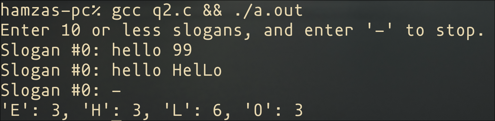
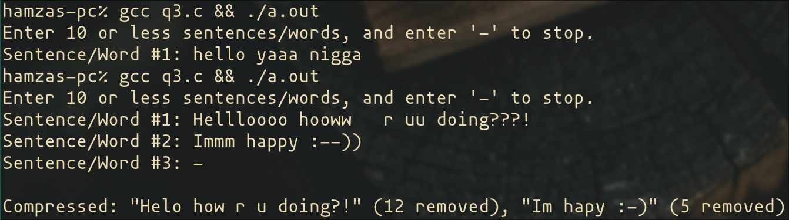

#+Title: Programming Fundamentals Theory Week 8 (Assignment 2)
#+Author: Hamza Shahid
#+Date: <2024-10-31 Thu>

* Second Smallest
* Letter Frequency
** Example Output

* Compressing Strings
** Example Output

* 
